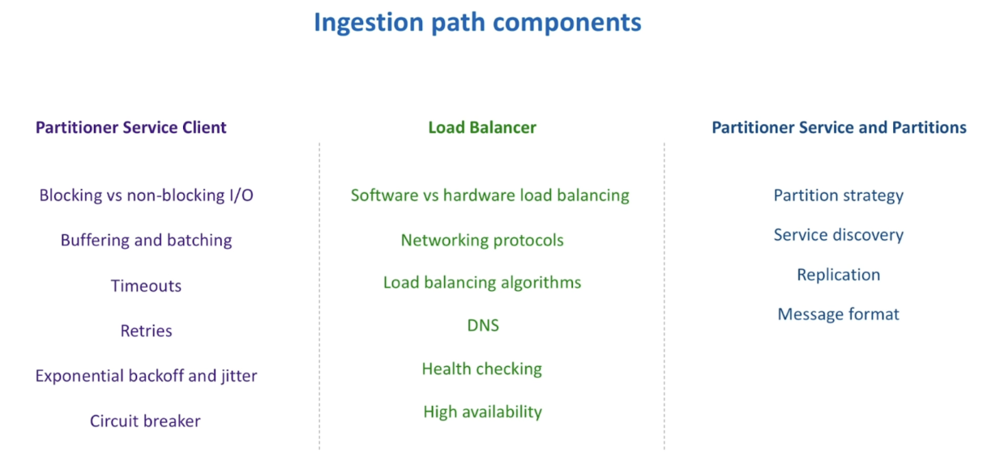
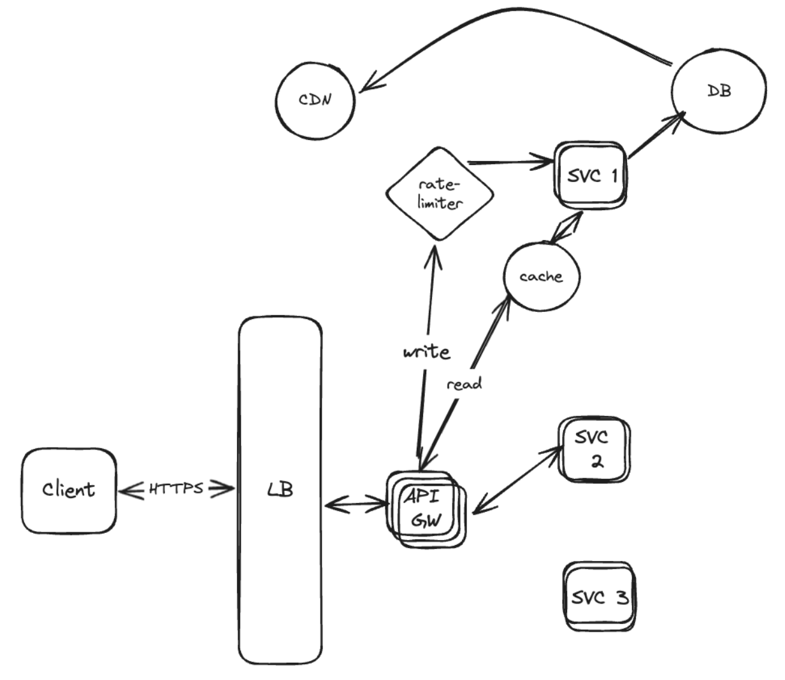
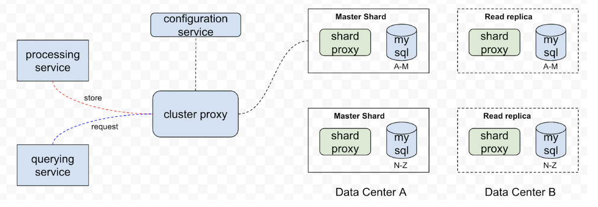
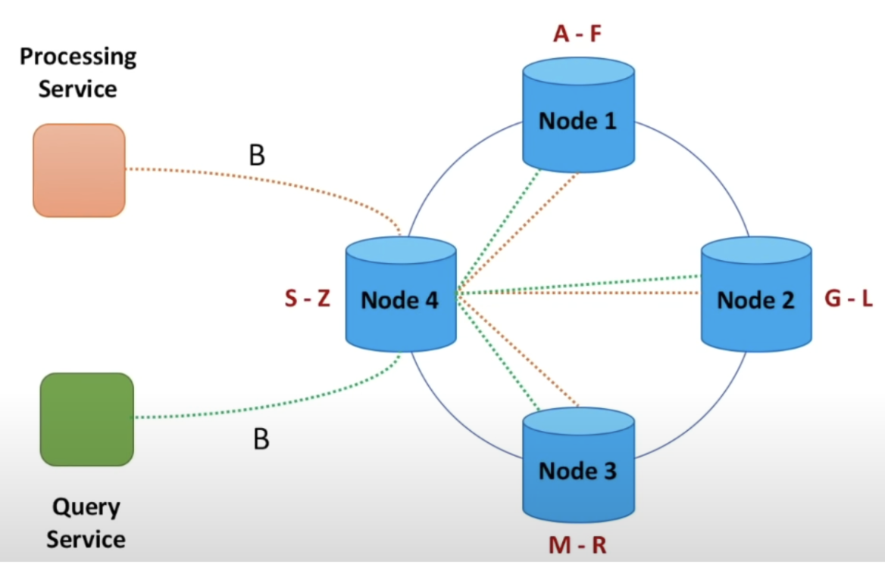
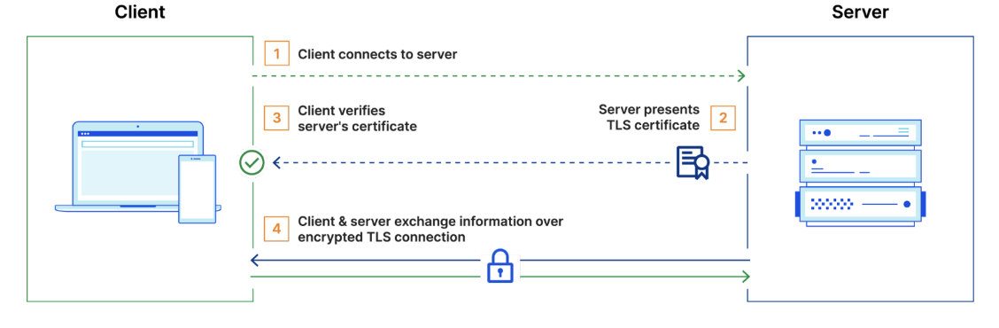

[Scalability](#scalability)

* [Things to consider while Scaling](#things-to-consider-while-scaling)

[Caching](#caching)

* [Types of Caching](#types-of-caching)

* [Ways to update cache](#ways-to-update-cache)

[Partitioning/Sharding](#sharding)

* [Ways to do sharding](#ways-to-do-sharding)

* [Consistent hashing](#consistent-hashing)

[Data Replication](#data-replication)

* [How to do replication](#how-to-do-replication)

[Load-Balancer](#load-balancer)

* [Types of Load Balancing](#types-of-load-balancing)

* [Load Balancing Algorithms](#load-balancing-algorithms)

* [Reverse Proxy](#reverse-proxy)

* [Load balancer vs reverse proxy](#load-balancer-vs-reverse-proxy)

[Latency and Throughput](#latency-and-throughput)

[Conflict Resolution](#conflict-resolution)

[High Level Components Diagram](#high-level-components-diagram)

[Consistency](#consistency)

[Availability](#availability)

* [How to achieve HA](#how-to-achieve-ha)

[DNS](#dns)

[Communication](#communication)

[Databases](#databases)

* [Techniques to scale SQL DB](#techniques-to-scale-sql-db)

* [NOSQL Databases](#nosql-databases)

* [Blob Storage (Amazon S3)](#blob-storage)

* [DB Communication](#db-communication)

[Security](#security)

* [SSL-TLS](#ssl-tls)

### Scalability

**Rules of scalability**

* Every server contains exactly the same codebase and does not store any user-related data, like sessions or profile pictures, on local disk or memory. Sessions need to be stored in a centralized data store which is accessible to all your application servers.   
* Denormalize data from the database & include no joins in any DB query.   
* In-memory caching helps with slow page requests.  
* Asynchronism can either be pre-computed values being served or have a queue of tasks or jobs that a worker can process when a request comes in.

**How to auto-scale?**

* Increase RPS (requests per second)  
* Reduce CPU load  
* Based on avg. number of open connections.

      
Note: AWS allows auto-scale on any metric as long as we can export that as a custom metric to cloudwatch.

**Deploy Applications across multiple servers**

* For K8s or Docker, use containerization technology.   
* Use config mgmt tools like ansible, chef to automate deployment & ensure consistency across servers.

Note: CI/CD pipeline can streamline deployment process.

**Session Stickiness/Session Persistence/Sticky Sessions**

* Make sure if a subsequent request comes as part of some session from a client, load balancer sends all requests to the same machine.  
* Sticky sessions ensure that the connection between the client and the network during a session is not lost as a result of requests being routed to different servers.  
* Sticky sessions are only visible at the load balancer layer  
* Sticky sessions send subsequent requests from the same client to the same machine by setting a cookie with a configurable name and TTL (Time-To-Live) duration.  
* Sticky sessions require your service to configure *externalTrafficPolicy: Local* to preserve the client source IP addresses when forwarding incoming traffic to other nodes.

     Cons of using a sticky session:

* It can cause uneven load distributions across servers.  
* If one server fails, it may disrupt the user experience.

**Different ways of Scaling**

* Vertical Scaling  
* Horizontal Scaling

### Things to consider while Scaling

#### Caching

##### Types of Caching

Client Caching \- located on client side (OS or browser), server side or in a distinct cache layer  
CDN Caching  
Web server Caching \- reverse proxies  
Database Caching  
Application Caching – in-memory caches (memcached/redis)

- Caching at DB query level  
- Caching at object level

##### Ways to update cache

**Cache-aside/Lazy loading**: Only requested data is cached. (look for entry in cache, if miss, load entry from DB, add entry to cache & return entry).  
**Write-through:** Write to cache, store in DB, return to user.  
**Write-behind/Write-back**: Write to cache, add event to q, return to user, async write to DB.  
**Refresh-ahead**

#### Sharding

* Table Partitioning (separate active data in separate table with archive table)  
* Vertical/Feature-based Partitioning (all data related to specific feature on same machine)  
* Horizontal/User-based Partitioning  
* Key-Based Partitioning (use part of the data itself to do the partitioning, one-way hashing algo)  
* Directory-based partitioning (maintains a lookup table somewhere in the cluster, that keeps track of which data is stored on which shard.)

##### Ways to do sharding

* Data Shards  
* Parity Shards  
* URL-based sharding: whenever asked to find the shard for a URL, it either pulls it from the directory/cache or, if it's not there, assigns it to one of the available shards for that entity type.  
* **Consistent Hashing**

##### Consistent Hashing 

* Rely on **consistent hashing** to distribute the load across multiple storage hosts.   
* In consistent hashing, the output range of a hash function is treated as a fixed circular space or “ring”.  
* Each node in the system is assigned a random value within this space which represents its “position” on the ring. Each data item identified by a key is assigned to a node by hashing the data item’s key to yield its position on the ring, and then walking the ring clockwise to find the first node with a position larger than the item’s position.   
* Thus, each node becomes responsible for the region in the ring between it and its predecessor node on the ring.   
* **The principal advantage of consistent hashing is that departure or arrival of a node only affects its immediate neighbors and other nodes remain unaffected.**   
* **Basic consistent hashing algorithm presents some challenges. First, the random position assignment of each node on the ring leads to non-uniform data and load distribution. Second, the basic algorithm is oblivious to the heterogeneity in the performance of nodes.**  
- To avoid this issue, instead of mapping a node to a single point in the circle, each node gets assigned to multiple points in the ring. When a new node is added to the system, it is assigned multiple positions in the ring.

#### Data Replication

* Single leader replication (eg: SQL db \- zookeeper)  
* Multiple leader replication (used to replicate across multiple datacenters)  
* Leaderless replication (eg: NoSQL DB \- cassandra)

##### How to do replication

* Replicate data on multiple hosts.  
* To detect the inconsistencies between replicas faster and to minimize the amount of transferred data, Dynamo uses Merkle trees

#### Load-Balancer

##### Types of Load Balancing

**No load balancing**: request directly to the web server.  
**Layer 4 load balancing**: load balance ***network traffic*** to multiple servers is to use layer 4 (transport layer) load balancing.  
**Layer 7 load balancing**: forward requests to different backend servers ***based on the content*** of the user’s request. 

##### Load Balancing Algorithms

**Static Load Balancing**

* **Round robin**/Weighted Round robin  
* IP Hash Method

**Dynamic Load Balancing**

* **Least connections**/Weighted least connections: server with the least number of connections. This is recommended for longer sessions. Weighted based on cpu/machine size.  
* Least Response Time  
* Resource-Based: Specialized software called an agent runs on each server and calculates usage of server resources, such as its computing capacity and memory. Then, the load balancer checks the agent for sufficient free resources before distributing traffic to that server.

**Sticky session/cookies**  
By request parameters/**source**: server to use based on a hash of the source IP address that users are making requests from

##### Reverse Proxy

A **reverse proxy** is a web server that centralizes internal services and provides unified interfaces to the public. Requests from clients are forwarded to a server that can fulfill it before the reverse proxy returns the server's response to the client.

Nginx  
Software HAProxy : HA Load Balancer Reverse Proxy 

Benefits:  
**SSL termination** \- Decrypt incoming requests and encrypt server responses so backend servers do not have to perform these potentially expensive operations ( no need for X.509)  
**Session persistence**/stickiness  
**Caching**  
**Increased security**

##### Load balancer vs reverse proxy

* Deploying a load balancer is useful when you have multiple servers. Often, load balancers route traffic to a set of servers serving the same function.  
* Reverse proxies can be useful even with just one web server or application server, opening up the benefits described in the previous section.  
* Solutions such as NGINX and HAProxy can support both layer 7 reverse proxying and load balancing.

#### Latency and Throughput

\<TODO\>

#### Conflict Resolution

When to perform the process of updating conflicts ie., resolve during reads or writes? If data store then \`**last write wins**\` but the application is aware of data schema so they can decide what is more suitable for the use case. 

### High Level Components Diagram

**Front end service**

* lightweight  
* stateless service deployed across several data centers

**Actions**:

* Request Validation  
* AuthN/AuthZ  
* TLS/SSL Termination  
* Server side encryption  
* Caching  
* Rate Limiting/Throttling (Leaky bucket algo)  
* Request dispatching/deduplicating  
* Usage data collection

**Backend service:**

* Leader-follower relationship (in-cluster manager eg: zookeeper)  
* Small cluster of independent hosts (out-cluster manager)

### Consistency

* Weak Consistency \- best effort approach. After a write, a read may or may not see it. eg: video chat, realtime games. Works well in real time use case.  
* Strong Consistency \- data is replicated synchronously. After a write, reads will see it. eg: file systems & RDMS. Works well in systems that need transactions.  
* Eventual Consistency \- data is replicated asynchronously. After a write, reads will eventually see it. eg: DNS/Email, S3, search engine. Works well in HA systems.

### Availability

***A high availability (HA) setup is broadly defined as infrastructure without a single point of failure.*** 

#### How to achieve HA

* Redundancy & Replication  
* Load Balancing  
* Failover clustering    
  * create a cluster of servers that work together to provide redundancy and seamless failover  
* Distributed data storage  
  * reduce the risk of data loss or corruption  
* Health monitoring & alerts  
* Geographic distribution  
  * deploying system components across multiple locations or data centers

**Fail-over**
* Active-passive/Master-slave: heartbeats are sent between the active and the passive server on standby. If the heartbeat is interrupted, the passive server takes over the active's IP address and resumes service.  
* Active-active/master-master: both servers are managing traffic, spreading the load between them.  

__Cons of fail-over__: More hardware & additional complexity. Potential for loss of data if active system fails.

### DNS

Routing of traffic using one of the below algos:  
**Weighted Round-Robin**: factors in server capacity, assigning more requests to higher-capacity servers.  
**Latency-based**  
**Geolocation-based**

### Communication

**Polling:**

**Websockets**: Websockets are a two-way communication channel between a client and a server. The client opens a connection to the server and keeps it open. The server keeps a connection open and sends new data to the client without requiring additional requests.   
  *Drawbacks*: Websockets are a good solution, and for real-time chat applications that have a more balanced read/write ratio, they are optimal. However, when the read/write ratio is not balanced 2-way communication channel is not optimal as there is overhead of maintaining connection on server

**Server Sent Events (SSE)**: SSE is a persistent connection just like websockets, but it is unidirectional and goes over HTTP instead of a separate protocol. This means that the server can send data to the client, but the client cannot send data to the server. Used when read ratio \>\> write ratio.  
  *Drawbacks*:  One of the primary issues is maintaining the persistent connection in environments where connections are routinely balanced across multiple servers. Handling reconnections gracefully is crucial. Although SSE automatically tries to reconnect when a connection is lost, ensuring that clients can seamlessly resume receiving updates without missing any data requires careful implementation on the server side.

### Databases

#### Techniques to scale SQL DB

**master-slave replication**  
**master-master replication**  
**federation**  
**sharding**  
**denormalization**  
**SQL tuning**

#### NOSQL Databases

Key-Value store (hash table)  
Document store (key-value store with documents stored as values)  
Wide column   
Graph DB (graph)  
**Sample data well-suited for NoSQL**:

* Rapid ingest of clickstream and log data  
* Leaderboard or scoring data  
* Temporary data, such as a shopping cart  
* Frequently accessed ('hot') tables  
* Metadata/lookup tables

#### Blob Storage

- store fast unstructured data  
- media retrieval is super fast/seamless

| Criteria | PostgreSQL | DynamoDB | Cassandra | Redis |
| ----- | ----- | ----- | ----- | ----- |
| **Type** | Relational (SQL) | NoSQL (Key-Value/Document) | NoSQL (Wide-Column Store) | NoSQL (Key-Value In-Memory Store) |
| **Data Model** | Relational (Tables with defined schema) | Key-Value, Document | Wide-Column, Key-Value | Key-Value, Hashes, Lists, Sets, Sorted Sets |
| **Write Performance** | Moderate (ACID transactions, good consistency) | High (Scales well with partitions, writes fast) | High (Scales well, optimized for writes) | Very High (In-memory, single-threaded, durable with persistence) |
| **Read Performance** | Moderate (Depends on indexes and queries) | High (Scales well, single-digit ms latency) | High (Optimized for read-heavy workloads) | Very High (In-memory, near-instant reads) |
| **Consistency** | Strong (ACID) | Tunable (Eventual by default, can be strong) | Tunable (Eventual, but adjustable consistency) | Strong for single-instance, eventual in cluster |
| **Scalability** | Vertical scaling (Add more resources) | Horizontal (Auto-scaling, global tables) | Horizontal (Masterless, scales linearly) | Horizontal (Redis Cluster or Sentinel) |
| **Partitioning / Sharding** | Limited support (manual partitioning) | Built-in with partition keys (automatic sharding) | Built-in (Data split across nodes) | Built-in with Redis Cluster |
| **Replication** | Synchronous and Asynchronous Replication | Multi-region, Multi-master, automatic | Multi-master (peer-to-peer) replication | Master-slave replication, Redis Cluster |
| **Transaction Support** | Full ACID transactions, complex queries | Limited transaction support (single partition) | Limited ACID-like transactions (lightweight) | Limited transaction support (MULTI/EXEC commands) |
| **Schema Flexibility** | Rigid (needs predefined schema) | Flexible (schema-less) | Flexible (schema-less, column families) | Schema-less |
| **Durability** | High (writes to disk with WAL logging) | High (Writes stored in SSD, eventual durability) | High (WAL logging, hints to ensure durability) | High (Snapshots, AOF for persistence) |
| **Use Case Fit** | Traditional relational apps, ACID compliance | Serverless, scalable apps, high throughput | High availability, fault-tolerant distributed systems | Caching, real-time analytics, fast data access |
| **Latency** | Moderate | Low | Low | Extremely low (in-memory access) |
| **Indexing** | B-tree, hash, GIN, GiST indexes | Secondary indexes | Secondary indexes, Materialized Views | Primary key only |
| **Querying** | SQL-based (complex joins, aggregates) | Limited querying capabilities, key-based | CQL (Cassandra Query Language) | Key-based querying (Lua scripts for custom queries) |
| **Best for** | Complex relational data, consistent queries | High-scale, low-latency applications | Large-scale, distributed systems, write-heavy workloads | High-performance caching, real-time data |

Search:  
Use Elasticsearch for searching service

* allows you to store, search, and analyze huge volumes of data quickly and in near real-time and give back answers in milliseconds.  
* It's able to achieve fast search responses because instead of searching the text directly, it searches an index.

### DB Communication

There are four qualities of a **REST**ful interface:

* **Identify resources** (URI in HTTP) \- use the same URI regardless of any operation.  
* **Change with representations** (Verbs in HTTP) \- use verbs, headers, and body.  
* **Self-descriptive error message** (status response in HTTP) \- Use status codes, don't reinvent the wheel.  
* [**HATEOAS**](http://restcookbook.com/Basics/hateoas/) (HTML interface for HTTP) \- your web service should be fully accessible in a browser.

Being stateless, REST is great for horizontal scaling and partitioning.

| Power of 2            Exact Value   Approx Value        Bytes \------------------------------------------------------------------------------- 7                                       128 8                                       256 10                                   1024   1 thousand            1 KB 16                                65,536                               64 KB 20                           1,048,576   1 million                1 MB 30                    1,073,741,824   1 billion                 1 GB 32                    4,294,967,296                                4 GB 40              1,099,511,627,776  1 trillion                 1 TB |
| :---- |

### Security

#### SSL-TLS

**TLS**: encryption protocol in wide use on the internet. authenticates the server in a client-server connection and encrypts communications between client and server so that external parties cannot spy on the communications.

**How does TLS work?**  
![][image5]

1. Public & private key \- uses public key cryptography  
2. TLS Certificate – data file containing info for verifying a server/device identity & cert expiry  
3. TLS Handshake – process of verifying the TLS cert & server’s possession of private key.also establishes how encryption will take place once the handshake is finished.

**mTLS/mutual authentication**: ensures that the parties at each end of a network connection are who they claim to be by verifying that they both have the correct private key.

**How does mTLS work?**  
The big difference is that both client & server have their own certificate in MTLS for verification.  

**What attacks do mTLS prevent?**

* Spoofing attacks  
* On-path attacks  
* Credential stuffing  
* Brute force attacks  
* Phishing attacks

OIDC (OpenID Connect): Is an identity authentication protocol that is an extension of OAuth2 to standardize the process for authenticating and authorizing users when they sign in to access digital services.

#### Encryption

Symmetric encryption: Using one key to encrypt & decrypt messages/communication.

Asymmetric encryption: Encryption is different on both sides; the sender and receiver use different keys. Also known as public key encryption. 

TLS uses both symmetric and asymmetric. TLS Handshake uses asymmetric encryption but they agree upon a new key for the session. That new key is symmetric encryption.

Why do websites need SSL Certificates?  
A website needs an SSL certificate in order to keep user data secure, verify ownership of the website, prevent attackers from creating a fake version of the site, and gain user trust.
