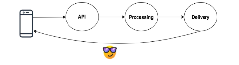
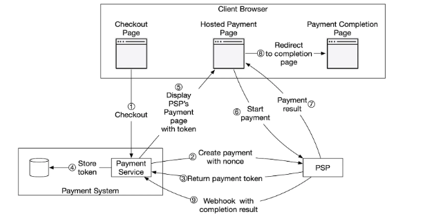
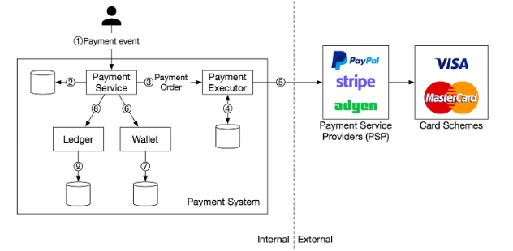
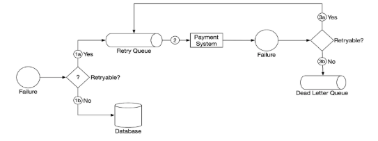

## High-Level approach:

### Step 1: Initial follow-up questions

- Who is going to use it?
- How are they going to use it?
- How many users are there?
- What does the system do?
- What are the inputs and outputs of the system?
- How much data do we expect to handle?
- How many requests per second do we expect?
- What is the expected read to write ratio?

### Step 2: Skeleton

- API Design
- Data Model
- Create high level design (sketch main components & connections)

### Step 3 \- Details for each core component

### Step 4: Scale the design

- Load balancer/horizontal scaling/sharding/caching/…

### Step 5: Security/Monitoring considerations

## Back-of-the-envelope calculations:

- Commonly asked estimations: QPS, peak QPS, storage, cache, number of servers
- Timestamp usually takes 7 bytes ( 4 bytes for date \+ 3 bytes for time)
- Size of ID \-\> 64 bit (8 bytes)

  | RPS | Total requests       |
  | :-- | :------------------- |
  | 1   | 2.5M requests/month  |
  | 4   | 10 M requests/month  |
  | 40  | 100 M requests/month |
  | 400 | 1B requests/month    |
  | 10K | 1B requests/day      |

  | Power of 2 | Exact Value       | Approx Value | Bytes |
  | :--------- | :---------------- | :----------- | :---- |
  | 7          | 128               |              |       |
  | 8          | 256               |              |       |
  | 10         | 1024              | 1 Thousand   | 1KB   |
  | 16         | 65,536            |              | 64 KB |
  | 20         | 1,048,576         | 1 Million    | 1 MB  |
  | 30         | 1,073,741,824     | 1 Billion    | 1 GB  |
  | 32         | 4,294,967,296     |              | 4 GB  |
  | 40         | 1,099,511,627,776 | 1 Trillion   | 1 TB  |

  | KiloByte (KB) | Thousand    | 103  |
  | :------------ | :---------- | :--- |
  | MegaByte (MB) | Million     | 106  |
  | GigaByte (GB) | Billion     | 109  |
  | TeraByte (TB) | Trillion    | 1012 |
  | PetaByte (PB) | Quadrillion | 1015 |

- **eg: 10Mil requests \* 1Kb data \= (10\*106)\*(103) \= 10 (109) \= 10GB storage**

- Caching \- 80:20 rule (20% of case generating 80% traffic)

- **How many app servers do we need?**
  - (\# of rps to handle)/(\# of rps a single server can handle)
  - Factors to consider: CPU Bound, Memory Bound, I/O Bound
    - CPU Bound:  
      \# of rps a single server can handle \= (\# of physical cores)/(time to process a single request)
- Media numbers
  - HD Image (FB/Instagram) 3MB
  - Profile pic (300x300px) \- 300Kb
  - Video (dependent on frame size/compression/duration) \- 1 min HD video \- 50 MB

Follow-up

- Read heavy vs Write heavy ? (read heavy \-\> federation/sharding)
- User base only in one region/multiple region/geo-located?

## HTTP codes

- **301 Redirect:** for shortened url to long url. When the requested URL is “permanently” moved to the long URL. Browser caches the redirected long URL so subsequent requests will not be sent to the backend service.
- **302 Redirect**: when a URL has been “temporarily” moved to a long URL. Subsequent requests will be sent to the backend service.
- **429 Too Many Requests**: Rate Limiting or when same operation is performed multiple times and we need to achieve idempotency (eg: for payment transactions)

## Protocols for event-driven API

| Protocol                                              | Use Case                                                   | Connection Type                                          | Scalability                                              | Latency                                          | Reliability                                           | Bi-Directional    | Example Use Cases                                                    |
| ----------------------------------------------------- | ---------------------------------------------------------- | -------------------------------------------------------- | -------------------------------------------------------- | ------------------------------------------------ | ----------------------------------------------------- | ----------------- | -------------------------------------------------------------------- |
| **Webhooks**                                          | One-way event notifications                                | Stateless (Push-based)                                   | High (easy to scale)                                     | Moderate (depends on HTTP response)              | Dependent on receiver uptime (HTTP retries available) | No                | **Payment notifications**, GitHub commits, Stripe events             |
| **WebSub**                                            | Publisher-subscriber model for webhooks                    | Stateless, event-driven (Push-Pull)                      | High (Hub manages subscriptions)                         | Low to Moderate                                  | Moderate (depends on hub and client uptime)           | No                | Blog update notifications, RSS feed subscriptions                    |
| **WebSockets**                                        | Real-time bi-directional communication                     | Persistent connection (full-duplex)                      | Scalable (via load balancing, sharding)                  | Low (very fast, near real-time)                  | High (keeps connection alive, can reconnect)          | Yes               | **Chat applications**, multiplayer games, stock trading platforms    |
| **Server-Sent Events (SSE)**                          | One-way server push notifications                          | Persistent connection (client listens, server pushes)    | Scalable (leverages HTTP/2, load balancing)              | Low (streaming data, but slower than WebSockets) | Moderate (depends on connection stability)            | No                | **Live sports updates, social media feeds, real-time notifications** |
| **MQTT** (Message Queue Telemetry Transport)          | Lightweight pub/sub for IoT and low-bandwidth environments | Persistent connection (Client-Server)                    | Very scalable (broker-based, optimized for many clients) | Very low (optimized for low-latency)             | High (QoS options ensure reliable delivery)           | No (only pub/sub) | IoT device communication, home automation, telemetry                 |
| **AMQP** (Advanced Message Queuing Protocol)          | High-performance message broker communication              | Persistent (pub/sub, point-to-point)                     | Highly scalable (broker-based)                           | Low (optimizes performance)                      | Very high (supports transactional messaging)          | No                | Enterprise messaging, task queues (e.g., RabbitMQ)                   |
| **Kafka** (Event Streaming Platform)                  | Distributed, high-throughput streaming platform            | Persistent (pub/sub, pull-based consumers)               | Extremely scalable (distributed brokers, partitions)     | Low (optimized for large scale streaming)        | Very high (guaranteed delivery with replication)      | No                | **Real-time event streaming**, log aggregation, analytics            |
| **gRPC Streaming**                                    | Real-time streaming RPC framework                          | Persistent (bi-directional or uni-directional streaming) | Scalable (HTTP/2 multiplexing, load balancing)           | Very low (low overhead with HTTP/2)              | High (supports retries and flow control)              | Yes               | Real-time microservices communication, video/audio streaming         |
| **XMPP** (Extensible Messaging and Presence Protocol) | Instant messaging and presence info                        | Persistent (bi-directional)                              | Scalable (federation possible)                           | Low (optimized for chat-like scenarios)          | High (supports delivery receipts, acknowledgments)    | Yes               | Instant messaging, presence updates, group chats                     |

Note:

- Only 6 concurrent SSE connections can be opened per web browser
- For SSE the data format is restricted to transporting UTF-8 messages

**What to use when?**

- Real-Time and Bi-Directional Communication: Use **WebSockets**, **gRPC Streaming**, or **XMPP** for applications needing real-time, low-latency, bi-directional communication.
- Server-to-Client Push: Consider **SSE** or **WebSub** for one-way, server-to-client push notifications.
- IoT and Low Bandwidth Networks: **MQTT** and **CoAP** are best suited for constrained devices in IoT environments where low power consumption and efficient communication are critical.
- Message Brokering and Event Streaming**: Use **Kafka**, **AMQP**, or **MQTT\*\* for large-scale, distributed event streaming or pub/sub messaging systems.

## Protocols for Push Notifications

**Apple Push Notification Service (APNs)**

- **Protocol**: APNs uses HTTP/2 for efficient, secure communication between the Apple servers and the devices.
- **Connection**: A persistent connection is maintained between the device and APNs, and Apple’s servers push notifications down the connection when necessary.
- **Data Format:** The notification payload is typically a JSON object, with the maximum payload size of 4 KB for notifications.
- **Security**: APNs enforces TLS encryption on all connections, and notifications are authenticated using a token-based system. Developers generate a JSON Web Token (JWT) that allows their server to communicate with APNs.

**Firebase Cloud Messaging (FCM) (Android, formerly GCM)**

- **Protocol**: FCM primarily uses HTTP/2 but also supports XMPP for more complex messaging scenarios (such as upstream messages).
- **Connection**: FCM keeps a persistent connection to its servers to push notifications to Android devices in near real-time. It supports one-to-one, group, and topic-based notifications.
- **Data Format**: The notification payload is also in JSON, with a similar size limit of 4 KB for notification data.
- **Security**: FCM uses TLS encryption for secure communication and supports token-based authentication (OAuth 2.0) and API key-based authentication for server communication.

## Some clarification questions based on scenario

### Web Server Is Overloaded

Here are a handful of things that might mean:

1. you don’t have enough workers to handle concurrent load,
2. not enough memory to run its workload,
3. not enough CPU to run its workload quickly,
4. disk are running out of [IOPs](https://en.wikipedia.org/wiki/IOPS),
5. not enough [file descriptors](https://en.wikipedia.org/wiki/File_descriptor),
6. not enough network bandwidth.

**Some solutions**: First vertical scaling & eventually horizontal scaling.

- servers use **threads for concurrency**. Check how many threads are running & requests per second. Then increase the number of threads. Limitation is that every additional thread consumes CPU & memory.
- If you become memory constrained before becoming CPU constrained, then another great option is to use a **_non-blocking web server_** which relies on async IO.
- Check if we can do **priority based scheduling**.
- If all options are done to process more requests then we break into **multiple servers** & use load balancer.

_If running out of memory_ – do sharding & adjust load balancer accordingly. Put more data on disk instead of in memory  
_If high CPU usage_ – rewriting & using CPU efficient language helps. Can see performance degradation.  
_If running out of IOPS (number of reads or writes your disk can do per second)_ – rewrite to write or read less frequently, can use cache in memory.  
If workloads with high concurrency – _run out of file descriptors_ – change a value in OS configuration

### Application is Slow

Here are a handful of things that might mean:

1. Lot of read/writes from/to database
2. Application is simply doing too much.
3. Users may be far away from the server (latency).

**Some solutions**:

- For every performance problem, the first step is **Profiling.**
- Add a cache like Redis or memcached if reading a lot from the database.
- Some tasks that won’t impact the user (like writing analytics), can use a message queue (SQS/RabbitMQ) & asynchronous workers.
- Use a CDN for a geographically distributed cache for static content.
- Will also need multiple datacenters in different regions. (Use Anycast DNS for picking the right datacenter).

### Database is Overloaded

Here are a handful of things that might mean:

1. Too many reads & databases become CPU bound.
2. Too many writes
3. Running out of IOPS or disk space.

**Some Solutions**:

- Use **replicas** for reading.
- Use **sharding** for writing.
- Can do _batching_ if sharding is not yet done. (eg: \# of views, visitor count)
- Use a different kind of database.

### Race condition when fetching values from cache

Assume the counter value in redis is 3. When 2 or more requests concurrently read the value before either of them writes it back. Each will increment the counter by 1 and write it back to 4 instead of 5. How can we avoid this race condition?

**Redis sorted sets** - collection of unique strings (members) ordered by an associated score. When more than one string has the same score, the strings are ordered lexicographically.

## Deep Dive Tools:

### Redis

In-memory single threaded data structure store. It can run as a single node, with a HA replica or as a cluster. Choosing how to structure your keys is how you scale Redis.

**Use Cases**:

- **Cache**: Employ a TTL on each key. Redis guarantees not to read the value after TTL expiry.
- **Distributed Lock**: In order to maintain consistency during updates or when we need to make sure multiple people aren’t performing an action at the same time. **Redlock algorithm**
- **Rate Limiting:** Common algo is a fixed-window rate limiter where we guarantee that the number of requests does not exceed _N_ over some fixed window of time _W._
- **Proximity Search**: Provides geospatial data structures that allow to store/manage/query geographic locations. Location is (lat, long and a name). GEORADIUS cmd is used given radius around a specific point.

**Hot Key Issue**: If load is not evenly distributed across the keys in our Redis cluster, we can run into a problem known as the "hot key" issue. Load on one server is dramatically higher than the rest of the servers. Potential solutions with tradeoffs are:

- We can add an in-memory cache in our clients so they aren't making so many requests to Redis for the same data.
- We can store the same data in multiple keys and randomize the requests so they are spread across the cluster.
- We can add read replica instances and dynamically scale these with load.

**How to scale Redis?**

- **Vertical Scaling** (increase RAM for handling larger datasets or increase CPU for certain complex workloads)
- **Horizontal Scaling**
  - Sharding ie., Partitioning Data across nodes using consistent hashing
  - Redis Sentinel for HA ie., 1 master multiple replica nodes. Write on master & slave nodes for read-only operations.
- **Redis Cluster**
  - Built-in solution for horizontal scaling. Supports both sharding & replication.
  - Reads directed to replica node, writes directed to the correct mast node for the key’s hash slot.

### Kafka

Messages sent and received through Kafka require a user **specified distribution strategy**.  
With **consumer groups**, each event is guaranteed to only be processed by one consumer in the group.  
A Kafka cluster is made up of multiple **brokers**. These are just individual servers (they can be physical or virtual). Each broker is responsible for storing data and serving clients. The more brokers you have, the more data you can store and the more clients you can serve.

Each broker has a number of **partitions**. Each partition is an ordered, immutable sequence of messages that is continually appended to - think of like a log file. Partitions are the way Kafka scales as they allow for messages to be consumed in parallel.

A **topic** is just a logical grouping of partitions. Topics are the way you publish and subscribe to data in Kafka. When you publish a message, you publish it to a topic, and when you consume a message, you consume it from a topic. Topics are always multi-producer; that is, a topic can have zero, one, or many producers that write data to it.

Kafka employs a leader-follower model for replication

**Scaling**  
a couple strategies at your disposal:

- **Horizontal Scaling With More Brokers**: The simplest way to scale Kafka is by adding more brokers to the cluster. This helps distribute the load and offers greater fault tolerance. Each broker can handle a portion of the traffic, increasing the overall capacity of the system.
- **Partitioning Strategy**: You need to decide how to partition your data across the brokers. This is done by choosing a key for your messages since the partition is determined by a consistent hashing algorithm on the key. If you choose a bad key, you can end up with hot partitions that are overwhelmed with traffic. Good keys are ones that are evenly distributed across the partition space.

**How can we handle hot partitions?**

- **Random partitioning with no key**: If you don't provide a key, Kafka will randomly assign a partition to the message, guaranteeing even distribution. The downside is that you lose the ability to guarantee order of messages. If this is not important to your design, then this is a good option.
- **Random salting**: We can add a random number or timestamp to the ad ID when generating the partition key. This can help in distributing the load more evenly across multiple partitions, though it may complicate aggregation logic later on the consumer side. This is often referred to as "salting" the key.
- **Use a compound key**: Instead of using just the ad ID, use a combination of ad ID and another attribute, such as geographical region or user ID segments, to form a compound key. This approach helps in distributing traffic more evenly and is particularly useful if you can identify attributes that vary independently of the ad ID.
- **Back pressure**: Depending on your requirements, one easy solution is to just slow down the producer. If you're using a managed Kafka service, they may have built-in mechanisms to handle this. If you're running your own Kafka cluster, you can implement back pressure by having the producer check the lag on the partition and slow down if it's too high.

**Fault Tolerance and Durability**  
The replication factor is the number of replicas that are maintained for each partition. A replication factor of 3 is common, meaning that each partition has 2 replicas. So if one broker fails, the data is still available on the other two and we can promote a follower to be the new leader.

**What happens when a consumer goes down?**

**Handling Retries and Errors**

### ZooKeeper

A zookeeper cluster, when deployed across at least three regions such that majority of the instances are not in any single region, can ensure read and write availability in the face of network partitions and region-level disasters. Global zookeeper clusters deployed like so can act as an underlying configuration store for active-active applications. Such a cross-region deployment can also make use of:

- Zookeeper read-mode for ensuring higher read availability
- Observers for scaling of reads
- Local instance discovery for lower request/response latencies

## Use-cases/Common Patterns:

### ID Generation {#id-generation}

1. 32 bit int will max out at 2B users… world population is 8B
2. Use 64 bit (8 bytes) unsigned ints for IDs \= 18 quintillion (18 million trillions) \- tip: [Powers of Two Table](https://en.wikipedia.org/wiki/Power_of_two#Table_of_values)
3. Pro tip: Make ID scheme using an epoch time (41 bits milliseconds) within 64 bit ID \- gives additional bits for shard IDs, random, etc. (this is the approach supposedly used by [Instagram](https://instagram-engineering.com/sharding-ids-at-instagram-1cf5a71e5a5c) to uniquely ID posts)
   - 41 bits time \+ 13 bits logical shard \+ 10 bits random mod 1024
4. Twitter’s Snowflake ID also 64 bit \- more complex \+ needs ZooKeeper
5. Don’t use UUID – needs 96-bits for reasonable uniqueness guarantees
6. Can also have SQL server just dedicated to IDs \- pair for even/odd

|           Method            | Unique | Scalable | Available | 64-bit numeric ID | Causality maintained |
| :-------------------------: | :----: | :--------: | :-------: | :---------------: | :------------------: |
|       **Using UUIDs**       |   ✖️   |     ✔️     |    ✔️     |        ✖️         |          ✖️          |
|    **Using a database**     |   ✖️   |     ✖️     |    ✔️     |        ✔️         |          ✖️          |
|  **Using a range handler**  |   ✔️   |     ✔️     |    ✔️     |        ✔️         |          ✖️          |
|  **Using UNIX timestamps**  |   ✖️   |  **Weak**  |    ✔️     |        ✔️         |       **Weak**       |
| **Using Twitter Snowflake** |   ✔️   |     ✔️     |    ✔️     |        ✔️         |       **Weak**       |

### Manage push infrastructure (TODO)

- Recycle connections after tens of minutes
- Randomize connection’s lifetime to avoid thundering herd
- More number of smaller servers \>\> few BIG servers for thundering herd
- Auto-scale on number of open connections per box instead of some other metric
- Websocket aware vs TCP load balancer

### Real-time interactions of live video

- **How to stream data?**
  - HTTP long poll from client to server for server sent events
  - chunks of data sent from server to client like the \`like\` or \`comment\` object.
  - Each chunk is processed separately at the client.
- **How to have multiple connections from real-time server to client**?
  - create persistent connection with a unique connectionID
  - The delivery system has a parent-child relationship where parents get notification which is broadcasted to all children.
- **How to determine which action goes to which live video as multiple live videos?**
  - Subscription. Client informs the server what video it is viewing.
  - Server stores that info in-memory (subscription table is local, tied to the delivery machine)
- **Concurrent Viewers?**

  - Add a dispatcher to dispatch requests to the delivery system. Dispatcher needs to know which system has connections and what it is viewing for sending the objects.
  - The dispatcher has a key-value store to store this info not in-memory so we could have more than 1 dispatcher.

- **How to scale?**
  - micro batching & aggregation  
    

### **Displaying thumbnails (TODO)**:

- Lot of small objects
- High number of disk seeks
- High \# of requests/sec
- 4 times thumbnails compared to video.
- thumbnails stored separately than video.
- Inode cache/directory level cache/page cache

  **How to serve thumbnails**?

### **Timeline**: (Design Twitter NewsFeed/FB/Instagram)

- Ensure to have a partition key & sort key for easy retrieval from the table.
- Fanout-on-read (slow & expensive)
  - query the list of accounts the user follows
  - fetch all the tweets from these accounts
  - sort by time & then return timeline
- Fanout-on-write (async update on tweet/post)
  - for newly created tweet, the tweet is placed on a message queue
  - this queue acts as a buffer
  - workers dedicated to fanout service will fetch from the queue & get a list of followers for that user.
  - each follower has timeline cache ie., quick access store for holding tweet/post from users they follow
  - worker job prepends new post in the user timeline cache.
  - This is write intensive but read is lightning fast.
- **Users with million followers cannot use fanout-on-write. For high profile accounts, we can do fanout-on-read**.

### Payment based system design (eg: Amazon payment checkout, Charity event payment, Stripe/Braintree/Square)

- Important non-functional requirements:

  - Strong Consistency
  - Idempotency (no double charging)
  - Reliability
  - Reconciliation
  - Fault-tolerance

* For idempotency \- we use idempotency-key that is unique & expires after a certain time generated at the client side. It is added as part of the HTTP Header. This id could be a UUID & on DB side we use the unique constraint feature to ensure the key is unique. Also if it is an idempotent request, on the backend side we return HTTP 429 too many requests.
  - **How to generate idempotency key**:
    - We can pre-materialize all keys & distribute to a bunch of servers & servers can assign this random key.
    - Client can generate some random hash or key like UUID, it then makes the request to the database to check if the key has already been taken or not. Ensure the database has the correct index on the table based on the key value.

- Key things to point out: Double entry ledger system (debit/credit at the same time in separate ledger accounts), PSP provides a hosted payment page that captures the customer card information directly, rather than relying on our payment service.
- Terms to use: Payment Service, Payment Executor, PSP (Payment Service Provider), Ledger/Wallet

- Questions to ask:
  - Is the application global & do we support multiple currencies?
  - Pay-in & pay-out service or just one.
  - Do we need to perform any reconciliations?
- Key number: Total transactions per day.

- API for payment service  
   **GET /v1/payments/{:id}** \- where id is payment_order_id (below)  
   **POST /v1/payments**

| Field            | Description                                                  | Type   |
| :--------------- | :----------------------------------------------------------- | :----- |
| buyer_info       | Info of the buyer                                            | json   |
| checkout_id      | globally unique ID for this checkout                         | string |
| credit_card_info | could be encrypted cc info or payment token. Specific to PSP | json   |
| payment_orders   | List of payment orders                                       | list   |

Payment_orders:

| Field            | Description                         | Type               |
| :--------------- | :---------------------------------- | :----------------- |
| seller_account   | which seller will receive the money | string             |
| amount           | transaction amount for the order    | string             |
| currency         | currency for the order              | string (ISO 4217\) |
| payment_order_id | globally unique ID for this payment | string             |

payment_order_id is the idempotency key which is globally unique.

Note: Keep amount in string to avoid issues w/ different numeric precision in serialization & deserialization. Also the amount could be extremely big or small.

Pay-in  
 
When the checkout is clicked, the payment service sends a request to PSP. It generates a UUID/nonce of the payment order. Payment service stores the token before calling the PSP hosted payment page (iframe/widget). Sensitive info never reaches payment service & is stored at PSP.

Some **failures** to consider:

- Handle payment processing delays ie., if PSP takes hours or days to complete or reject a request.
  - This can be handled either by the PSP calling a registered webhook mentioned as part of the initial request.
  - Or, the payment service would have some sort of cron job that looks at all pending transactions and calls the PSP to check the status.
- Communication among internal services
  - Use Async Communication either with a Message Queue or Kafka depending on whether we want a single receiver to get an event or multiple receivers. (in our case multiple receivers).
- Handling failed payments
  - Storing payment state during the payment cycle is important. It can be persisted in an append-only database table.
  - Retry queue & DLQ:
    - retry queue for transient error
    - DLQ if a message fails repeatedly.

- **Exactly-once delivery**
  - We need to execute to at-least-once using **retry**
    - can use exponential backoff. Need to determine appropriate retry strategy.
  - Also, execute it at-most-once using **idempotency check**
    - Use UUID as idempotency key.It can be added to the HTTP header.

eg: [Design payment system - mock w/ Ruturaj](https://docs.google.com/drawings/d/1S470A1T1axl9OYe4IsebvLXRyzX0MyTd5qnrBy3NAhE/edit)

### AutoSuggest/Auto-Complete (typeahead, google search)

![][image5]

### Geo-Location/Proximity based service ( Yelp, Doordash, Uber…)

- Important Non-functional requirements: **Low Latency**, **Strong Consistency in ride/dasher matching, High Throughput** (large requests from same location)
- To begin with, input from clients can just be lat & long. Additionally, a radius can also be provided by the user based on the app.
- **Drivers/Dashers** communicate with Location service to send real-time location updates.
- **Location service** manages real-time location of drivers. Responsible for receiving location updates from drivers, storing this information in the database, and providing the Ride Matching Service with the latest location data to facilitate accurate and efficient driver matching.
- **Ride/Dasher Matching Service** handles incoming request to match requests with best drivers based on proximity, availability and other factors.
- **Notification Service:** responsible for real-time notifications to drivers when new request is matched. Can be sent via APN or FCM.

- Since there will be a large number of writes as dashers/drivers ping their location continuously, we cannot use Postgres or DynamoDB since it can’t handle so many writes. Also, querying those is not efficient.
- **Real-time in-memory geospatial** Data Store (Redis)
  - [**Geo-Hashing**](https://www.pubnub.com/guides/what-is-geohashing/) \- encoding method to encode geographic coordinates (lat & long) into short string of digits and letters. More characters in the string, more precise the location. Eg: coordinate pair 28.6123,77.2291 can be converted to ttnfv2u.
  - The length of the geohash determines its precision. A longer geohash represents a smaller geographic area. For example, a geohash with 5 characters might represent an area of a few square kilometers, while a geohash with 9 characters might represent an area as small as a few square meters. Let’s say we decide on length L. We will use this L length prefix as our shard key & distribute the current object locations to those shards for better load distribution.
- Requirements for implementation:
  - current location of an object (drivers in case of Uber, delivery agent’s location in case of a food delivery app)
  - Mapping from a Geo-Hash prefix to the objects
  - Proper expiry of the dynamic location data since in this use case, we are dealing with dynamic objects.
- Use Redis to model this.
  - When we get a location pinged from a device, we identify the Geo-Hash of that location, take a hash prefix of length L, find out the shard & index machine where it lies from the central metadata registry & add or update the location information in that machine. The location keeps getting updated every 10 or 30 seconds whatever we decide. As you remember, these locations will always keep on getting updated. We can set the expiry to a few minutes for this kind of key & with every update, we can increase the expiry time.
  - We use Redis TTL which allows us to retain only the most recent location updates and avoid unnecessary storage costs.
  - Since Redis is in-memory there is a risk of data loss in case of system crash or power failure. We can mitigate that by
    - **Redis Persistence**: Periodically save data to disk using **Append-only File** or Redis Database.
    - **Redis Sentinel**: We could use Redis Sentinel for **high availability.** Sentinel provides automatic failover if the master node goes down, ensuring that a replica is promoted to master.
- Also, in order to ensure we don’t send the same driver multiple ride requests, we need to use a distributed lock with TTL. When a ride request is sent, a lock is created with a uniqueID (eg, driverId) and a TTL set to the acceptance window maybe 10 sec. The ride matching service tries to acquire the lock and if successfully acquired means no other service instance can send a ride request to the driver. If driver does not accept within the TTL the lock in Redis expires automatically.

![][image6]

### When to use API Gateway

- It is a fully managed service that centralizes and manages access to your APIs. Some of the popular services it supports
  - Rate limiting
  - SSL termination
  - Authentication
  - IP Whitelisting
  - Servicing static content
  - Abuse protection/DoS attack

#### Rate Limiting {#rate-limiting}

- Token bucket algo

  - Algo:
    - A token bucket is a container that has pre-defined capacity.
    - Tokens are put in the bucket at preset rates periodically.
    - Once the bucket is full, no more tokens are added.
    - The refiller puts 2 tokens into the bucket every second. Once the bucket is full, extra tokens will overflow
  - Buckets can either be based on APIs if we are rate limiting based on APIs or if based on IP address each IP address requires a bucket. If the system allows a blanket of max requests per seconds, having a global bucket sharing all requests makes sense.
  - Response HTTP Code: 429 Too Many Requests
  - How does the client know if the request is being throttled?

    - HTTP Headers

      X-Ratelimit-Remaining: remaining \# of allowed requests in the window

      X-Ratelimit-Limit: how many calls can make per time window

      X-Ratelimit-Retry-After: \# of seconds to wait until next request

- Leaky bucket algorithm
  - Similar to token bucket but implemented using a FIFO queue
  - Algo:
    - When a request arrives, the system checks if the queue is full. If it is not full, the request is added to the queue.
    - Otherwise, the request is dropped.
    - Requests are pulled from the queue and processed at regular intervals.
  - Memory efficient given the limited queue size.
  - Requests are processed at a fixed rate therefore it is suitable for use cases that a stable outflow rate is needed.

### Unique Hash Function (url shortening)

#### Hash \+ Collision Resolution

Use a well-known hash function like MD5 or SHA-1. Take the first x characters of the hash value.This method can lead to hash collisions. To resolve collisions, we can recursively append a new predefined string until there are no more collisions.  
This can eliminate collisions but it is expensive to query the database to check if a shortURL exists for every request. For that we can use **bloom filter.**

#### Base 62 conversion

- commonly used for URL shortening.
- This base is used as there are 62 possible characters for hashValue (10(0-9) \+ 26(A-Z) \+ 26(a-z))
- Downside is the short URL length is not fixed. It goes up with the ID. (The ID is unique generator using snowflake approach, [here](#id-generation))

### How to upload large files(gdrive/dropbox)/videos(youtube)?

- Store the files in blob storage. Instead of the server getting the file & then uploading it to a blob storage like S3, the server should generate a **pre-signed url** (allow temporary access to private resources.) and return that to the user/caller.
- The caller can then use the presigned-url to upload the file directly to the blob storage.
- This is faster and cheaper than uploading the file to our backend first.
- Once the file is uploaded, the Blob Storage service can send a notification to our backend so we can save the metadata.![][image7]

- For large files user experience is important. We need two key insights

  - **Progress Indicator**: Users should be able to see the progress of their upload & estimation of how long it will take.
  - **Resumable Uploads**: Users should be able to pause & resume uploads.

- #### **Limitations of uploading large files**

  - **Timeouts** (for a large file a POST request may timeout.)
  - **Browser & server Limitation** (most cases it’s not possible to upload a large file 50GB via a single POST request due to browser/server limitations ie., size of payload) AWS API Gateway limit is just 10MB & NGINX is 2GB.
  - **Network Interruptions**: Large files are susceptible to network interruptions.
  - **User Experience**: Users don’t know the progress of their upload or how long it will take or whether it is working or not.

- #### How to resolve these limitations?

  - **Chunking**: Break files into smaller pieces & upload them one at a time or in parallel. Needs to be done on the client so the file can be broken into pieces before sending it to the server or S3. Typically break the file into 5-10MB pieces.
  - Advantage is we can easily show the progress & update the end time providing better user experience.
  - **How to handle resumable uploads?**
    - Need to keep track of which chunks have been uploaded and which haven’t. Can be done by saving the state of upload in DB.

- #### High-Level Algorithm

  - Compress the file (based on the file type ie., media not helpful but text high compression ratio) in order to make the upload as fast as possible.
  - Encrypt the file for security. Encryption in Transit, at Rest & also have access control in place.
  - The client will chunk the file into 5-10Mb pieces and calculate a fingerprint for each chunk. It will also calculate a fingerprint for the entire file, this becomes the fileId.
  - The client will send a GET request to fetch the FileMetadata for the file with the given fileId (fingerprint) in order to see if it already exists \-- in which case, we can resume the upload.
  - If the file does not exist, the client will POST a request to /files/presigned-url to get a presigned URL for the file. The backend will save the file metadata in the FileMetadata table with a status of "uploading" and the chunks array will be a list of the chunk fingerprints with a status of "not-uploaded".
  - The client will then upload each chunk to S3 using the presigned URL. After each chunk is uploaded, S3 will send a message to our backend using S3 event notifications. Our backend will then update the chunks field in the FileMetadata table to mark the chunk as "uploaded".
  - Once all chunks in our chunks array are marked as "uploaded", the backend will update the FileMetadata table to mark the file as "uploaded".

###

### How to handle large volume of writes to database (counter or likes to a post)

One way to address this is by adding more capacity to our service and partitioning the incoming requests. By using a log/stream like Kafka, we can fan out the requests to multiple instances and partition the load. We can also buffer requests so that we can handle bursts of post creation or other action. Finally, we can scale out our index by sharding the indexes by keyword. This way writes to the indexes are spread across many indexes.

For batching writes, instead of writing every update to our indexes or database, we can batch likes for a given postId over a period (like 30 seconds). Then, instead of needing to write 500 times for a particularly viral post, we can make 1 update with an increment of 500\. For this, we need a second service like `batcher` which accepts “like” events and aggregates them over a fixed window before writing them to Kafka/Log Stream to be consumed.

**Sharding and partitioning** distribute the load.  
**Batch writes** and **eventual consistency** balances write efficiency and read accuracy.  
**Atomic operations** and **optimistic locking** ensure consistency during high concurrency.  
**Caching** improves read performance.  
**Database choice** (NoSQL vs. SQL) is crucial for handling write-heavy systems.

### How to do Pagination for services like News Feed?

**Offset Pagination**: is a technique that uses an offset to specify the starting point for fetching a set of results. Initially, the offset is set to 0 to load the most recent comments, and it increases by the number of comments fetched each time the user scrolls to load more (known as the page size).  
 _Drawbacks_: offset pagination is inefficient as the volume of comments grows. The database must count through all rows preceding the offset for each query, leading to slower response times with larger comment volumes. Most importantly, offset pagination is not stable.  
Eg API call: GET /feed/:userID?offset=0\&pagesize=10

**Cursor Pagination**: is a technique that uses a cursor to specify the starting point for fetching a set of results. The cursor is a unique identifier that points to a specific item in the list of results. Initially, the cursor is set to the most recent comment, and it is updated each time the user scrolls to load more.  
 _Drawbacks_: still requires a database query for each new page of results, which can be significant in a high-traffic environment like ours.  
Eg API call: GET /feed/:userID?cursor={last_feed_id}\&pagesize=10

**Cursor Pagination with Prefetching & Caching**: the cursor point to a specific item in the result set, but the system also prefetches a larger set of results (e.g., pagesize \* N) and stores them in a cache. This means that when a user scrolls for more comments, the application can quickly retrieve these prefetched comments from the cache, reducing database queries and improving response times.  
 _Drawbacks_: primary challenge with this approach is managing the cache effectively, especially in a highly dynamic environment where comments are frequently added. Ensuring the cache stays synchronised with the latest data while minimising overhead can be complex.

### How to do searching for post search or tweet search in a large data store?

**Full-text search** is the ability to search through a large amount of text data and find relevant results. **Search optimized databases**, on the other hand, are specifically designed to handle full-text search. They use techniques like indexing, tokenization, and stemming to make search queries fast and efficient. In short, they work by building what are called inverted indexes. **Inverted indexes** are a data structure that maps from words to the documents that contain them  
**Tokenization**: Is the process of breaking a piece of text into individual words. This allows you to map from words to documents in the inverted index. specialized tokenizers, for example CamelCase tokenizer, URL tokenizer, path tokenizer and N-gram tokenizer

**Inverted Index**: the index is organized by terms (words), and each term points to a list of documents or web pages or posts that contain that term.  
 Ideally we can use redis to store these info.  
**Bigrams/Shingles**: Create tokens for pair of words in a sentence.  
**Stemming**: Stemming is the process of reducing words to their root form. This allows you to match different forms of the same word. For example, "running" and "runs" would both be reduced to "run".  
**Fuzzy Search**: Is the ability to find results that are similar to a given search term. Most search optimized databases support fuzzy search out of the box as a configuration option. In short, this works by using algorithms that can tolerate slight misspellings or variations in the search term. This is achieved through techniques like edit distance calculation, which measures how many letters need to be changed, added, or removed to transform one word into another.  
**ElasticCache** \- search optimized database

## Questions:

**Sample Questions**

- Design the architecture for Facebook, Twitter, Uber or Foursquare.
- Diagram a basic web application of your choice.
- Design a reliable website similar to a newspaper’s website.
- Design a scalable API to power a mobile game.

Template:  
\<problem\>  
Follow-up Questions \- \[5 min\]  
Functional/Non-Functional Requirements/Estimations \- \[10 min\]  
APIs/High Level Design/Data Model \- \[10 min\]  
Detailed Design \- \[15-20 min\]  
Constraints/Additional use-cases/follow-up \- \[5 min\]

### Design Twitter timeline & search

Step 1:  
Use-cases/Goals:

- User posts a tweet
- User can view their own timeline
- User can view the home page which lists tweets from what user is following
- User searches for keyword
- High Availability

Non-Goals:

- Service pushing tweet to other integrations/streams
- Analytics
- ??User edits/deletes a tweet??

Possible variations:

- Reply within a tweet
- Retweet
- Tweet delivery (push notification)
-

Constraints:

- Traffic is not evenly distributed
- Posting a tweet should be fast
  - Fanning out a tweet to all of your followers should be fast, unless you have millions of followers

Some rough numbers:

- Total Daily Active Users: 100Mil
- Total Tweets per day: 500Mil
- Total tweets per month: 15 Bil
  - Each tweet fanout to 10 users
  - Total tweets fanout per day: 5 Bil
  - Total tweets fanout per month: 150 Bil
- Total tweets read per month: 250 Bil
- Total tweet search: 10 Bil

Step 2:  
Estimation:

- **Storage**:

      Users → 100Mil
      user\_id \-\> unique identifier \- 12 bytes or 16 bytes
      user\_handle \-\> 15 bytes
      user\_name \-\> 50 bytes
              user\_location \-\> 255 bytes
      user\_bio \-\> 255 bytes
      user\_photo \-\> link to S3 \-\> 255 bytes

  Total size of storing users: \~ 1Mb per user  
  If total user is 1 Billion \-\> \~ **125 TB for user metadata**

Tweets \-\> 500Mil unique tweets per day  
Each tweet \-\> 160bytes  
Store: tweet_id (10 bytes) \+ user_id (16 bytes) \+ tweet_metadata (160 bytes) \+ media (10Kb) ?  
Total size per tweet: 10.2Kb  
Total size to store tweet daily: 500Mil \* 10.2Kb \~ **640GB**  
Total size to store tweet monthly: \~ **150 TB**  
Assume we store tweets for 3 years: 150Tb \* 12 \* 3 \~= **5PB**

- **QPS**
  - Write
  - Read
- Latency?
- Memory

### Design Web Crawler

Questions:

- Goal of web crawler data mining/search indexing? \- Web Crawler
- Total number of web pages crawled per month? \- 1 Billion
- Content type, only HTML or PDF & images as well? \- Only HTML
- What about duplicate HTML pages? \- ignore them
- How long to store HTML pages crawled? \- 5 years
- Should we crawl new pages or edit web pages? \- Yes
- How often should we re-crawl? \- Once a day

Functional Requirements:  
Crawl web pages given a starting list of web pages.

Non-Functional Requirements:  
Politeness \- Not make a lot of requests in a short period of time to a particular website.  
Scalability \- Web is large & billions of pages.  
Robustness \- Should be able to handle bad HTML, malicious links, unresponsive servers etc.

Estimations:  
RPS: 1\* 10e9/30\*10e5 \= 1000/3 \~ **400 RPS**  
Peak RPS \= 2 \* RPS \= 800 RPS  
Avg. page size \= 500Kb  
Total Storage per month: 1\*10e9 \* 500 \* 10e3 \= 500\* 10e12 \= 500TB storage per month.  
Data stored for 5 years \= 500TB \* 12 \* 5 \= 30000TB \= **30 PB**

High Level Design

### Design Notification System

### ![][image8]

### Design a distributed rate limiter

To consider:

- [ ] Client side rate limiter or server side API rate limiter
- [ ] Throttle API based on what rules? IP, user ID, country or any other properties?
- [ ] Scale of the system
- [ ] Is it a separate service used within the company or should be implemented in application code?
- [ ] Silently drop requests or inform users?

Some questions to think about:

- Should the rate limiter be implemented on the server side or in API gateway?

  Some guidelines:

- Evaluate your current technology stack
- Identify the rate limiting algorithm that fits your business needs
- Building your own rate limiting service takes time. If you do not have enough engineering resources to implement a rate limiter, a commercial API gateway is a better option.

Algorithms for rate limiting: ([ref](#rate-limiting))

- Token bucket (widely used)
- Leaky bucket
- Fixed window counter
- Sliding window log/counter

High Level design

![][image9]  
Deep Dive  
How does a client know if a request is being throttled?

- In the HTTP response header:  
  **X-Ratelimit-Remaining**: The remaining number of allowed requests within the window.  
  **X-Ratelimit-Limit**: It indicates how many calls the client can make per time window.  
  **X-Ratelimit-Retry-After**: The number of seconds to wait until you can make a request again without being throttled.

![][image10]
